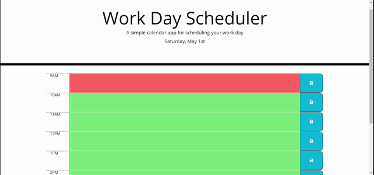

# Day Planner

The basic functionality of this web application is to provide a 9am-5pm work day scheduler that save user notes to set hourly timeblock and provides saved notes on page reloads.  

The current, past, and future hours are color-coded so as to indicate user's position in their schedule:
* Gray - previous hours (past)
* Red - current hour (present)
* Green - appraoching hours (future)

Current day is updated on page load and also displayed in the page header.  Time stamps are updated for time-blocks and current day using the moment.js library.

A save button is displayed next to each time-block which saves notes from its corresponding block once clicked.  User is alerted when and which note is saved. User can clear the text area and use save to clear a note.

JavaScript code also implements jQuery libraries for DOM traversal and manipulation.

## Demo

## Links

[Github Repo](https://github.com/Curtisaurus/dayplanner)

[Live page](https://curtisaurus.github.io/dayplanner/)